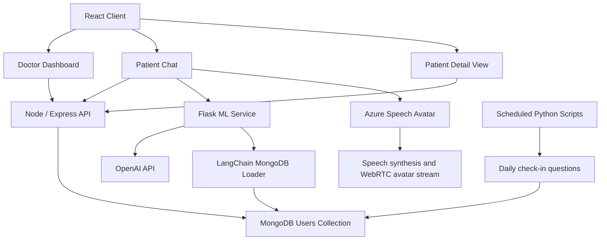
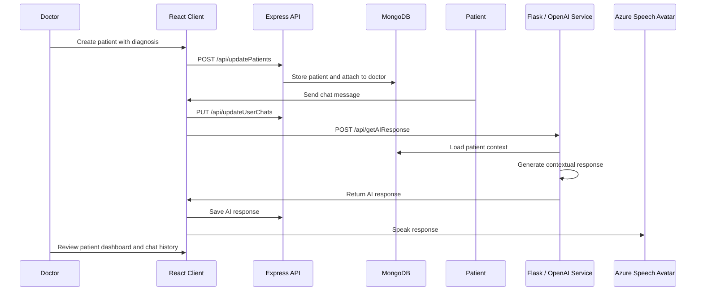

# HealthSync

**Winner of Best Healthcare Hack at Hackalytics 2024.**

HealthSync is a full-stack healthcare support platform built for Hackalytics 2024. The application helps doctors manage patients, monitor wellness trends, and support patient check-ins through an AI-assisted chat experience with speech and avatar interaction.


## Repository Description

AI-powered healthcare dashboard for doctors and patients, built with React, Node/Express, MongoDB, Flask, OpenAI, and Azure Speech Avatar for patient monitoring and chat-based check-ins.

## Overview

Healthcare teams often need frequent patient updates, but manual check-ins are time-consuming and difficult to scale. HealthSync combines a doctor dashboard, patient portal, AI chat assistant, speech input, avatar-based responses, and patient trend visualization into one prototype workflow.

Doctors can create patient accounts, review patient details, inspect chat history, update notes, and monitor wellness indicators. Patients can interact with AI-DOC through text or speech, receive AI-generated responses, and maintain a communication trail that doctors can review.

## Key Features

- Doctor and patient account flows
- Doctor dashboard for patient management
- Patient creation with initial diagnosis and contact details
- Patient detail pages with notes, chat history, and analytics
- Patient-facing chat interface with AI and doctor communication modes
- Speech-to-text input for patient messages
- Azure Speech Avatar integration for spoken AI responses
- OpenAI-powered response generation using patient context
- MongoDB-backed user, patient, notes, and chat storage
- Chart.js visualizations for sleep efficiency, alcohol consumption, exercise, and mental health score
- Scheduled scripts for daily check-in question generation

## Architecture



## Tech Stack

| Layer | Technologies |
| --- | --- |
| Frontend | React, React Router, Chart.js, React Icons, Azure Speech SDK |
| Backend API | Node.js, Express, Mongoose, MongoDB |
| AI Service | Python, Flask, Flask-CORS, OpenAI, LangChain |
| Patient Interaction | Web Speech Recognition, Azure Speech Avatar |
| Data Visualization | Chart.js, react-chartjs-2 |
| Deployment Support | Dockerfile for client, Vercel config for database server |

## Repository Structure

```text
.
├── README.md
├── client/
│   ├── package.json
│   ├── Dockerfile
│   └── src/
│       ├── App.js
│       ├── apiConfig.js
│       └── components/
│           ├── shared/
│           │   ├── Header/
│           │   ├── LogIn/
│           │   └── SignUp/
│           └── views/
│               ├── Dashboard/
│               ├── Patient/
│               ├── PatientChat/
│               ├── Chat.js/
│               ├── Home/
│               └── Error404/
├── db_server/
│   ├── index.js
│   ├── package.json
│   ├── vercel.json
│   └── models/
│       └── user.model.js
├── ml_server/
│   └── app.py
├── mongo.py
├── openAI.py
└── time_script.py
```

## Application Flow



## Frontend Routes

| Route | Purpose |
| --- | --- |
| `/` | Home page with login and signup modals |
| `/dashboard` | Doctor dashboard for viewing and adding patients |
| `/patient/:name` | Doctor view of a patient's details, notes, charts, and chat history |
| `/chat` | Patient chat interface with AI-DOC and doctor communication tabs |
| `*` | 404 fallback page |

## Backend API

The Node/Express service runs on port `1337` by default.

| Method | Endpoint | Purpose |
| --- | --- | --- |
| `POST` | `/api/createUser` | Create a doctor or patient user |
| `POST` | `/api/findUser` | Find a user by email |
| `POST` | `/api/findUserById` | Find a user by MongoDB ObjectId |
| `POST` | `/api/login` | Validate login credentials |
| `POST` | `/api/updatePatients` | Create a patient and attach them to a doctor |
| `PUT` | `/api/updateNotes` | Update patient notes |
| `PUT` | `/api/updateAge` | Update patient age |
| `PUT` | `/api/updateUserPhone` | Update patient phone number |
| `PUT` | `/api/updateUserChats` | Replace a user's chat history |

## ML Service API

The Flask service runs on port `5000` by default.

| Method | Endpoint | Purpose |
| --- | --- | --- |
| `POST` | `/api/getAIResponse` | Generate an AI response using the current chat and patient context |

## Data Model

MongoDB stores users and patients in the `users` collection.

| Field | Purpose |
| --- | --- |
| `type` | User role, such as `Doctor` or `Patient` |
| `doctorEmail` | Links a patient to their doctor |
| `name` | User or patient name |
| `email` | Login and lookup identifier |
| `pass` | Password field |
| `age` | Patient age |
| `phone` | Patient phone number |
| `chats` | Message history with content, date, and time |
| `activeTracking` | Current tracked wellness category |
| `trackingData` | Smoking, weight, and alcohol tracking values |
| `aiGeneratedInfo` | Sleep, smoking, exercise, alcohol, age, doctor summary, and mental health score arrays |
| `notes` | Doctor-provided patient notes and diagnosis context |
| `patients` | Doctor's list of patient ObjectIds |

## Prerequisites

- Node.js and npm
- Python 3.10 or newer
- MongoDB Atlas database or local MongoDB instance
- OpenAI API key
- Azure AI Speech resource for avatar and text-to-speech features
- Azure Communication Services relay credentials for avatar WebRTC connectivity

## Setup

Clone the repository:

```console
git clone https://github.com/pramitbhatia25/HealthSync-Hackalytics2024.git
cd HealthSync-Hackalytics2024
```

### 1. Configure Environment Values

Before running the project, move secrets and service credentials into environment variables. Recommended variables:

```env
MONGODB_URI=your_mongodb_connection_string
OPENAI_API_KEY=your_openai_api_key
AZURE_SPEECH_REGION=your_azure_speech_region
AZURE_SPEECH_KEY=your_azure_speech_key
AZURE_SPEECH_VOICE=en-US-JennyNeural
AZURE_AVATAR_CHARACTER=lisa
AZURE_AVATAR_STYLE=casual-sitting
AZURE_ICE_URL=your_azure_ice_url
AZURE_ICE_USERNAME=your_azure_ice_username
AZURE_ICE_CREDENTIAL=your_azure_ice_credential
```

The current code uses hard-coded local URLs for the frontend API configuration:

```javascript
const API_BASE_URL = 'http://localhost:1337';
const ML_BASE_URL = 'http://localhost:5000';
```

Update `client/src/apiConfig.js` if your services run on different hosts or ports.

### 2. Run the Database API

```console
cd db_server
npm install
npm run nodemon
```

The Express API starts on:

```text
http://localhost:1337
```

### 3. Run the ML Service

The repository does not currently include a `requirements.txt`, so install the Python dependencies manually:

```console
cd ml_server
python -m venv .venv
source .venv/bin/activate
pip install flask flask-cors openai pymongo langchain langchain-community schedule pytz
python app.py
```

The Flask API starts on:

```text
http://localhost:5000
```

### 4. Run the React Client

```console
cd client
npm install
npm start
```

The React app starts on:

```text
http://localhost:3000
```

## Scheduled Check-Ins

The root-level `time_script.py` script is designed to retrieve patient records, generate or send check-in questions, and append those prompts to patient chat histories.

It includes two question flows:

- hard-coded daily wellness questions
- OpenAI-generated questions based on doctor notes

Run it separately from the web services:

```console
python time_script.py
```

## Demo Screenshots

The original project README includes screenshots of the concept, patient interaction flow, doctor insights, and mental health scoring:


## Security Notes

- Do not commit API keys, database credentials, Azure keys, or relay credentials.
- Rotate any credentials that were previously committed to the public repository.
- Store secrets in `.env` files or deployment secret managers.
- Passwords should be hashed before storage. The backend includes `bcrypt`, but the current login flow compares plaintext passwords.
- Do not use this prototype with real patient data without proper authentication, authorization, encryption, auditing, and healthcare compliance review.

## Award

HealthSync was awarded Best Healthcare Hack at Hackalytics 2024.

## Contributing

Contributions are welcome. Fork the repository, create a feature branch, and open a pull request with a clear summary of the change.
